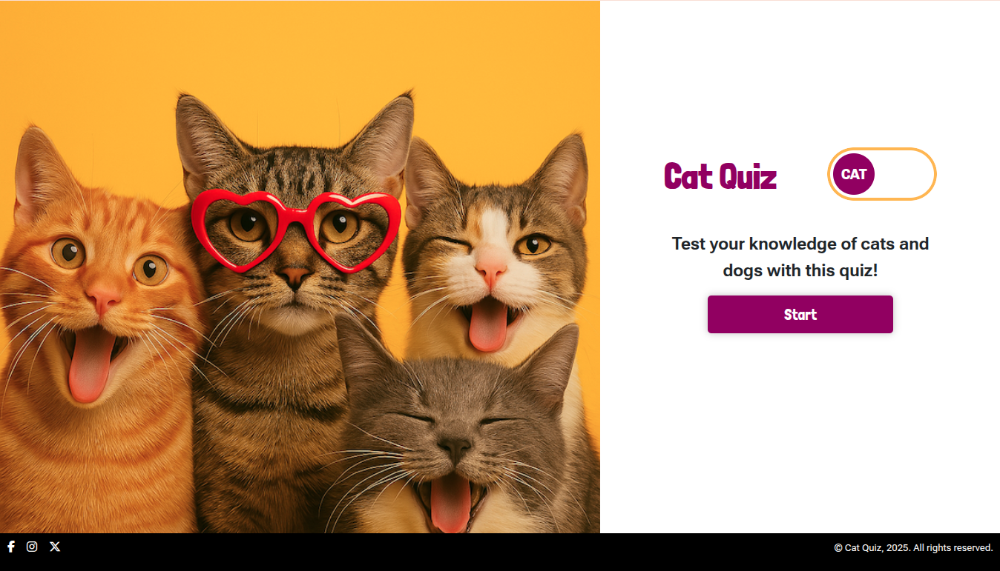
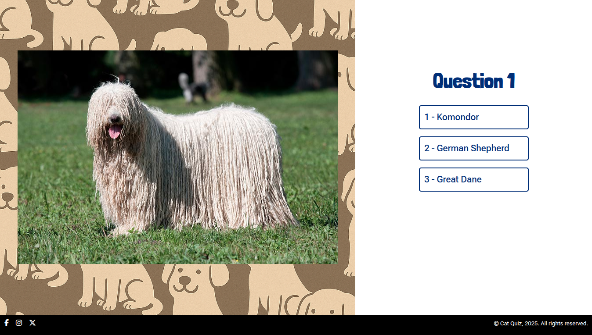
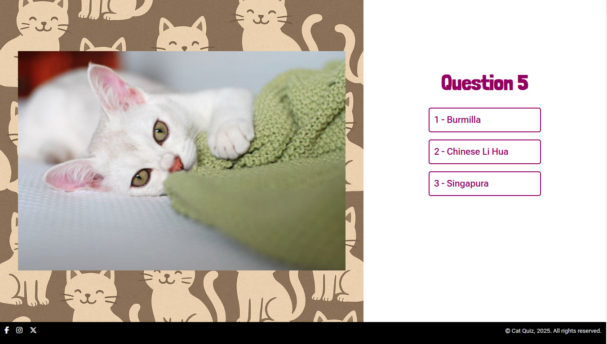
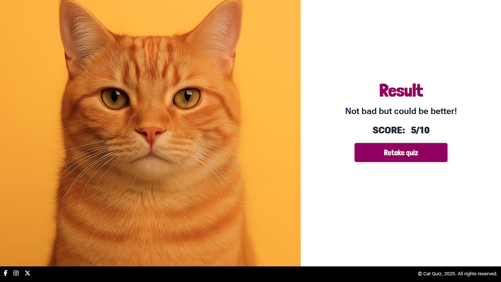

> A little hack-a-thon from last summer—our first for the Code Institute. A single-page quiz that lets you test your knowledge of cats and dogs, with real breed images and a confetti finish.

**Cat Quiz** is a 10-question multiple-choice game where you can switch between cat and dog rounds. Each question shows breed images (fetched from [API Ninjas](https://api-ninjas.com/)) and three options. The app tracks your score, gives immediate feedback, and ends with a results screen and a confetti effect.

### Design and UX

The site was designed to be playful and easy to use: warm yellows and oranges, strong contrast with black text, and a clear flow from welcome → questions → results. Wireframes were done for both mobile and desktop so the layout stays consistent and responsive.

### Tech and structure

- **Stack:** HTML5, CSS3, vanilla JavaScript (ES6).
- **Modules:** Question generation, UI updates, start/score layout toggles, image fetching, DOM refs, and shared data for ~70 cat and ~100 dog breeds.
- **External:** [@tsparticles/confetti](https://www.npmjs.com/package/@tsparticles/confetti) (v3.0.3) for the end-of-quiz celebration; [Google Fonts](https://fonts.google.com/) and [Font Awesome](https://fontawesome.com/) for type and icons.

Working together on this was a good lesson in coordinating as a team—especially managing Git and merges across several people.

### Collaborators

- **Sandy** — Lead
- Beth
- Marijonas
- Dallow
