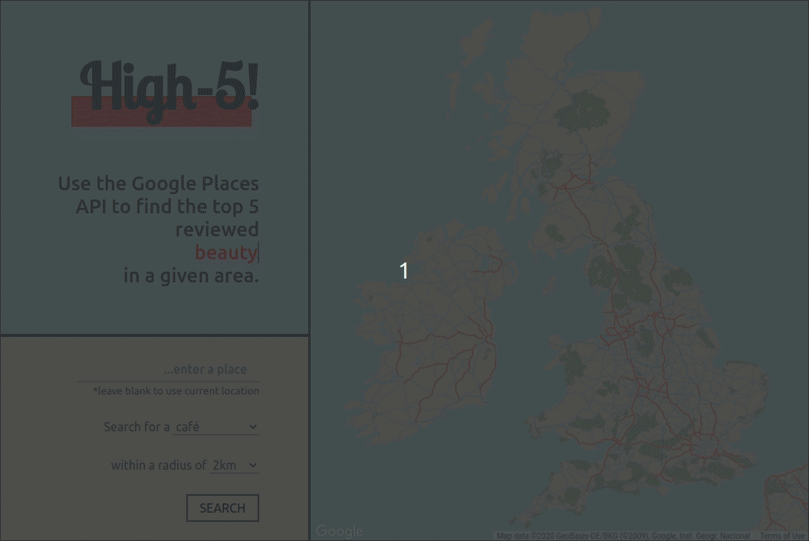

> Use the Google Maps APIs to search for specific businesses within a given search radius and rank them by user rating.

### Goals

- Use Google's Map APIs to request specific data, sort that data and display accordingly.

- Use the user's location via the Navigator.geolocation web API or take an input and get location from Google's Geocode library.
- Request place details via the Places API set to a specific business type, as [categorised&nbsp;by&nbsp;google](https://developers.google.com/places/supported_types).
- User can set the search radius.
- Present the top 5 user-reviewed places, with all relevant details and place a marker on a map of the searched area accordingly.

Of course, you could just type into google what you are looking for and be presented with the same information. This is more an exercise in utilising and customising all the pieces of the puzzle.



Building this taught me a lot, and to go through every step could get a little laborious, so I'll just break it down into a few key takeaways.

### Styling a google map.

You can totally customise how the map is presented by passing a JSON array along with your MapsAPI request. I've written a short article about it you [can&nbsp;checkout&nbsp;here](/blog/styling-google-maps).

### The Places API

When you make the initial call to the Maps API, you pass an object with some key value pairs. In there is your API key and a list of any other libraries that you may want to utilise. The Places library lets you query all the information that google has on businesses, local landmarks and the precise location of... well, everything. Google is just about omnipotent, so it's understating the fact to call this a powerful tool. In this project I use the Places Autocomplete functionality, which seems to instantly update the text input with place name suggestions. I set this to UK suggestions only to improve the likelihood of a match.
When you initiate a Google Maps instance, other methods become available. You can then query for 'places' a certain search radius from a location of a certain business type. In the example below, 'searchRadius' and 'establishmentType' are variables set from the user input.

```javascript
let latitude = parseFloat(location.coords.lat);
let longitude = parseFloat(location.coords.lng);
let coords = new google.maps.LatLng(latitude, longitude);
// sets parameters for places service search
const request = {
  location: coords, //   center of search coordinates
  radius: searchRadius, //   radius of the search in meters
  type: establishmentType, //   type of establishment to search for
};
let service = new google.maps.places.PlacesService(map);
service.nearbySearch(request, searchPlaces);
```

The data received contains a lot of the data we need, but not all of it. First though, we can extract the average rating, and number of ratings. We use to top 5 rated, out of a possible 60, so long as it has more than 5 reviews. Then we can then perform another method on the Place library, `getDetails()` on only the 5 business we want details for using each one's unique place id.

```javascript
topFive.forEach(function (shop) {
  let request = {
    placeId: shop.placeId,
    fields: [
      "name",
      "place_id",
      "formatted_address",
      "geometry",
      "photo",
      "user_ratings_total",
      "formatted_phone_number",
      "opening_hours",
      "website",
      "rating",
      "review",
    ],
  };
  service.getDetails(request, addResultToArray);
});
```

The results of this don't always come back in the order they were sent, because each request is just sent out there one after another and then returned when they have been processed. So you have to send them all, wait till they are all in, sort again, and only then display the results. (perhaps you could _await_ each call before sending the next, but I feel this could slow it down a touch.)

### Conclusions

The power of Google is ridiculous, and if you can imagine a way to utilise the technology, the tools that Google provide make it possible. An area for improvement for this app would be to use the 'Directions' library, so when the user selects the place they want to visit, they can find there way there. Of course the more of these tools you add, it just becomes a Google search. In a real world scenario you'd probably streamline the data requested, so for example, a store locator, and directions to it.
