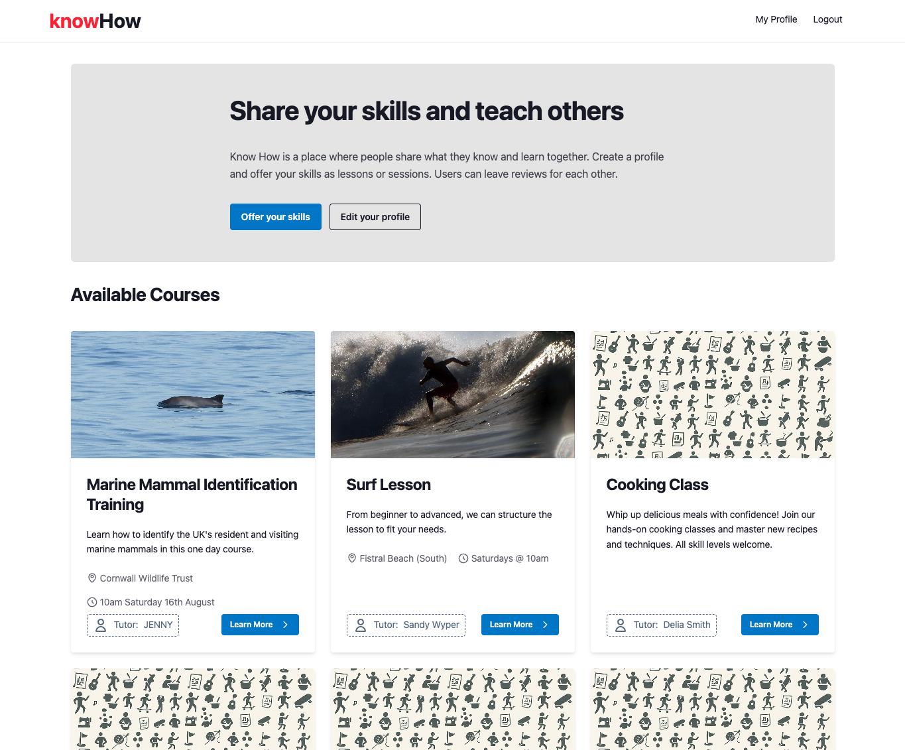
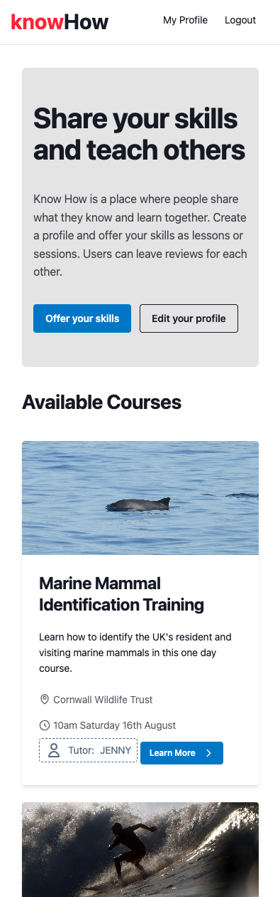
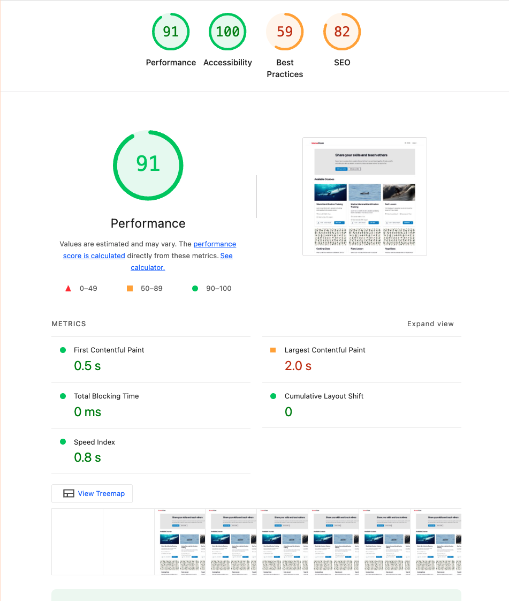

> A skill-sharing platform that connects learners with teachers, built with Python, Django, and PostgreSQL.

When I set out to build **Know-How** for my Code Institute capstone project, I knew I wanted to work with Python and Django. There's something satisfying about building a full-stack application where you can leverage Python's readability and Django's "batteries included" philosophy. The result is a skill-sharing marketplace—think Airbnb, but for knowledge—where users can create profiles, offer their skills through listings, and build trust through reviews.



## Why Python and Django?

I've always appreciated Python's clean syntax and how it lets you focus on solving problems rather than wrestling with syntax. Django takes that philosophy and extends it to web development. The ORM (Object-Relational Mapping) system is particularly powerful—instead of writing raw SQL queries, you work with Python objects, and Django handles the database interactions behind the scenes.

For this project, I used **Django 4.2.23** with **Python 3.x**, which gave me access to modern features like async views and improved performance optimizations. The framework's built-in admin panel was a lifesaver during development, letting me quickly test and manage data without writing custom admin interfaces.

## The Database Stack: SQLite to PostgreSQL

One of the great things about Django is how it handles databases. During development, I used **SQLite**—it's perfect for local work because it's file-based and requires zero configuration. But when it came time to deploy, I switched to **PostgreSQL** for production.

PostgreSQL is a proper relational database that handles complex relationships beautifully. In Know-How, I had users, listings, reviews, and categories all interconnected through many-to-many and foreign key relationships. PostgreSQL's support for these relationships, combined with Django's ORM, made it straightforward to query things like "show me all listings by users who have an average rating above 4.5" without writing complex SQL.

The migration from SQLite to PostgreSQL was seamless—Django's database abstraction meant I just changed the `DATABASE_URL` environment variable, ran migrations, and everything worked. That's the power of using an ORM.



## Building the Backend

The backend architecture follows Django's MTV (Model-Template-View) pattern. Models define the data structure, views handle the business logic, and templates render the HTML. This separation of concerns made the codebase maintainable and easy to reason about.

### Models and Relationships

The data model was where things got interesting. I had users who could create multiple listings, listings that belonged to categories, and reviews that connected users to listings. Django's ORM made these relationships elegant:

- Users could have many listings (one-to-many)
- Listings could belong to multiple categories (many-to-many)
- Reviews connected users to listings (many-to-one with additional fields like rating and comment)

Working with these relationships in Python felt natural. Instead of writing JOIN queries, I could do things like `user.listings.all()` or `listing.reviews.filter(rating__gte=4)`.

### Views and Business Logic

Django's class-based views were perfect for this project. I used `ListView` for displaying listings, `DetailView` for individual listing pages, and `CreateView`/`UpdateView` for forms. The mixin system let me add authentication checks, permission handling, and pagination with just a few lines of code.

For example, ensuring only authenticated users could create listings was as simple as adding `LoginRequiredMixin` to the view class. Django handles the redirect logic automatically.

## Frontend: Tailwind and DaisyUI

While Django handled the backend, I used **Tailwind CSS** and **DaisyUI** for the frontend. Tailwind's utility-first approach meant I could style components directly in the HTML without writing custom CSS. DaisyUI provided pre-built components that matched the design aesthetic I was going for.

The frontend stack includes:

- **HTML5** for semantic markup
- **Tailwind CSS** for styling
- **DaisyUI** for component library
- **JavaScript** for interactive features

## Third-Party Integrations

I integrated several Django packages to extend functionality:

- **Django Allauth** for authentication—handles registration, login, password reset, and social auth
- **Cloudinary** for image storage—no need to manage file uploads locally
- **Django Summernote** for rich text editing in listing descriptions
- **Crispy Forms** for beautiful form rendering with Tailwind styling
- **WhiteNoise** for serving static files efficiently in production

## Working with the Database

One of my favorite parts of working with Django and PostgreSQL was how intuitive database queries became. Instead of writing SQL like:

```sql
SELECT * FROM listings
WHERE user_id IN (
    SELECT user_id FROM reviews
    GROUP BY user_id
    HAVING AVG(rating) > 4.5
);
```

I could write Python:

```python
highly_rated_users = User.objects.filter(
    reviews__rating__gte=4.5
).distinct()
listings = Listing.objects.filter(user__in=highly_rated_users)
```

Django's ORM handles the SQL generation, and I get the benefits of type checking and IDE autocomplete. Plus, if I ever need to switch databases (unlikely, but possible), the Python code stays the same.

The database schema evolved as I built features. Django's migration system made this painless—whenever I changed a model, I'd run `python manage.py makemigrations` to generate the migration files, then `python manage.py migrate` to apply them. The migration files are version-controlled, so I could track exactly how the database structure changed over time.

## Testing the Stack

Testing Django applications is straightforward thanks to the built-in test framework. I wrote unit tests for form validation, model methods, and view logic. The test database is created fresh for each test run, so tests don't interfere with each other.

I focused heavily on form validation testing since that's where user input needs to be sanitized and validated. Django's form system makes this easy—you define validation rules in the form class, and Django handles the rest.

For manual testing, I checked the application across different browsers and devices. The responsive design with Tailwind CSS meant the mobile experience was solid from the start.



## Deploying to Production

Deploying a Django app to **Heroku** is relatively straightforward. The key was setting up environment variables for sensitive data like the `SECRET_KEY` and `DATABASE_URL`. Heroku provides a PostgreSQL add-on, so I didn't need to manage a separate database server.

The deployment process:

1. Set environment variables in Heroku's dashboard
2. Configure `DATABASE_URL` to point to Heroku's PostgreSQL instance
3. Run migrations on the production database
4. Collect static files with `python manage.py collectstatic`
5. Deploy using Git push

**WhiteNoise** handles static file serving, and **Cloudinary** manages uploaded images. This keeps the application lightweight and scalable.

The transition from SQLite (development) to PostgreSQL (production) was seamless—Django's database abstraction layer handled everything. I just changed the database configuration, ran migrations, and the app worked.

## What I Learned

Building Know-How was a great way to dive deep into the Python/Django/SQL stack. Here's what stood out:

**Django's ORM is powerful.** Being able to work with database relationships using Python objects instead of SQL queries made the code more readable and maintainable. When I needed to refactor the data model, Django's migration system handled the database changes automatically.

**PostgreSQL is robust.** Moving from SQLite to PostgreSQL for production showed me the difference between a file-based database and a proper relational database. PostgreSQL handled concurrent users, complex queries, and data integrity much better.

**Python's ecosystem is rich.** Between Django's built-in features and the vast package ecosystem (Django Allauth, Crispy Forms, etc.), I rarely had to build something from scratch. This let me focus on the unique features of Know-How rather than reinventing authentication or form handling.

**Testing pays off.** Writing tests for form validation and model methods caught bugs early. Django's test framework made it easy to write comprehensive tests, and running them before each deployment gave me confidence that everything still worked.

## AI-Assisted Development

I used AI tools throughout this project, which was particularly helpful for:

- **Understanding Django patterns** - When I wasn't sure how to structure a many-to-many relationship or implement a custom manager, AI helped explain the Django way of doing things
- **Debugging database issues** - Migration conflicts and query optimization problems were easier to solve with AI assistance
- **Generating test cases** - AI helped create comprehensive test suites, achieving around 85% code coverage
- **Code quality** - AI suggestions helped me follow Django best practices and PEP 8 conventions

The AI tools didn't replace learning—they accelerated it. I still needed to understand what the code was doing, but AI helped me get there faster.

## Final Thoughts

Know-How was a great project for exploring the Python/Django/PostgreSQL stack. The combination of Python's readability, Django's "batteries included" philosophy, and PostgreSQL's robust relational database features made building a full-stack application enjoyable and efficient.

The platform successfully connects learners with teachers, and the technical foundation—Python backend, Django framework, and PostgreSQL database—provides a solid base for future enhancements. Whether it's adding new features, scaling to more users, or optimizing queries, the stack I chose gives me flexibility and power.

If you're interested in seeing the code or trying out the platform, check out the [GitHub repository](https://github.com/SandyWyper/Know-How).

---

**Know-How** - _Connecting learners with teachers, one skill at a time._
